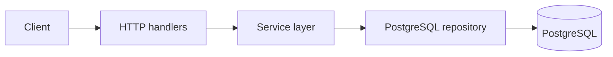

# todoapp-golang

`todoapp-golang` is a small REST API written in Go for managing users and tasks, plus a statistics endpoint for task analytics. It uses PostgreSQL, plain SQL migrations, layered service/repository design, and structured logging.

## What This Project Provides

- CRUD endpoints for users
- CRUD endpoints for tasks
- A statistics endpoint for task counts and completion metrics
- PostgreSQL-backed persistence with SQL migrations
- Request tracing, request IDs, and panic recovery middleware
- JSON request and response handling

## Architecture

The app is wired in `cmd/todoapp/main.go`:



Project layers:

- `cmd/todoapp` bootstraps the application.
- `internal/core` contains shared domain models, logging, HTTP server plumbing, middleware, and Postgres pool abstractions.
- `internal/features/users` contains the users feature.
- `internal/features/tasks` contains the tasks feature.
- `internal/features/statistics` contains the statistics feature.
- `migrations` contains the SQL schema migrations.

## Project Structure

- `cmd/todoapp/main.go` application entry point
- `cmd/todoapp/Dockerfile` multi-stage container build
- `docker-compose.yaml` local Postgres, migration, and port-forward services
- `Makefile` helper targets for local development and migrations
- `internal/core` shared infrastructure and domain types
- `internal/features` business features and their HTTP/service/repository implementations
- `migrations` database schema changes

## Requirements

- Docker and Docker Compose
- `make`
- A Go toolchain compatible with the module version declared in `go.mod`

## Configuration

The application reads configuration from environment variables using `envconfig`.

### Database

The Postgres pool uses the `POSTGRES_` prefix:

| Variable | Required | Default | Purpose |
| --- | --- | --- | --- |
| `POSTGRES_HOST` | yes | - | Postgres host name |
| `POSTGRES_PORT` | no | `5433` | Postgres port |
| `POSTGRES_USER` | yes | - | Database user |
| `POSTGRES_PASSWORD` | yes | - | Database password |
| `POSTGRES_DB` | yes | - | Database name |
| `POSTGRES_TIMEOUT` | yes | - | Per-operation timeout, for example `5s` |

### HTTP Server

The HTTP server uses the `HTTP_` prefix:

| Variable | Required | Purpose |
| --- | --- | --- |
| `HTTP_ADDR` | yes | Bind address, for example `0.0.0.0:8080` |
| `HTTP_SHUTDOWN_TIMEOUT` | yes | Graceful shutdown timeout, for example `30s` |

### Logger

Logger settings use no prefix:

| Variable | Required | Default | Purpose |
| --- | --- | --- | --- |
| `LOGGER_LEVEL` | no | `DEBUG` | Zap log level |
| `LOGGER_FOLDER` | yes | - | Folder for log files |

When you run the app through `make todoapp-run`, the Makefile exports `POSTGRES_HOST=localhost` and `LOGGER_FOLDER=$PROJECT_ROOT/out/logs` for you.

### Current Local Example

The repository includes a local `.env` with values similar to:

```env
POSTGRES_USER=postgres
POSTGRES_PASSWORD=postgres
POSTGRES_DB=postgres
POSTGRES_TIMEOUT=5s

HTTP_ADDR=0.0.0.0:8080
HTTP_SHUTDOWN_TIMEOUT=30s

LOGGER_LEVEL=DEBUG
```

If you run the binary directly instead of using `make todoapp-run`, also set:

```env
POSTGRES_HOST=localhost
LOGGER_FOLDER=./out/logs
```

## Local Development

1. Start the Postgres container:

```bash
make env-up
```

2. Expose Postgres on `localhost:5433`:

```bash
make env-port-forward
```

3. Apply the migrations:

```bash
make migrate-up
```

4. Run the API:

```bash
make todoapp-run
```

The API listens on the address from `HTTP_ADDR`, which is `http://localhost:8080` in the current `.env`.

## Make Targets

- `make env-up` starts the Postgres container
- `make env-down` stops the Postgres container
- `make migrate-up` applies the database migrations
- `make migrate-down` rolls back the latest migration step
- `make migrate-create seq=<name>` creates a new SQL migration pair
- `make todoapp-run` starts the API locally
- `make logs-cleanup` deletes files under `out/logs`
- `make env-cleanup` removes the Postgres data volume and local database files

## Database Schema

The initial migration creates the `todoapp` schema and two tables:

### `todoapp.users`

- `id` serial primary key
- `version` optimistic lock column, default `1`
- `full_name` required text, 3 to 100 characters
- `phone_number` optional text, must match `+` followed by digits and be 10 to 15 characters long

### `todoapp.tasks`

- `id` serial primary key
- `version` optimistic lock column, default `1`
- `title` required text, 1 to 100 characters
- `description` optional text, 1 to 1000 characters
- `completed` required boolean
- `created_at` required timestamp
- `completed_at` optional timestamp
- `author_user_id` required foreign key to `todoapp.users(id)`

The database also enforces that:

- incomplete tasks must have `completed_at = NULL`
- completed tasks must have a non-null `completed_at`
- `completed_at` cannot be earlier than `created_at`

## API Conventions

- Base URL: `/api/v1`
- Content type: JSON
- All endpoints are currently unauthenticated
- `DELETE` endpoints return `204 No Content`
- `POST` endpoints return `201 Created`
- `PATCH` and `GET` endpoints return `200 OK`
- Errors return JSON in the shape:

```json
{
  "message": "human readable context",
  "error": "underlying error message"
}
```

Error status mapping:

- `400 Bad Request` for invalid input
- `404 Not Found` when a resource does not exist
- `409 Conflict` for optimistic locking conflicts
- `500 Internal Server Error` for unexpected failures

The server also adds an `X-Request-ID` header and logs each request with that ID.

## Users API

### Endpoints

| Method | Path | Description |
| --- | --- | --- |
| `POST` | `/api/v1/users` | Create a user |
| `GET` | `/api/v1/users` | List users |
| `GET` | `/api/v1/users/{id}` | Get one user |
| `PATCH` | `/api/v1/users/{id}` | Update a user |
| `DELETE` | `/api/v1/users/{id}` | Delete a user |

### Create User

Request body:

```json
{
  "full_name": "Jane Doe",
  "phone_number": "+77001234567"
}
```

Rules:

- `full_name` is required and must be 3 to 100 characters
- `phone_number` is optional
- if present, `phone_number` must start with `+` and be 10 to 15 characters long

Example:

```bash
curl -X POST http://localhost:8080/api/v1/users \
  -H "Content-Type: application/json" \
  -d '{"full_name":"Jane Doe","phone_number":"+77001234567"}'
```

### List Users

Query parameters:

- `limit`
- `offset`

The code passes these values directly into the SQL query, so provide them when listing users.

Example:

```bash
curl "http://localhost:8080/api/v1/users?limit=20&offset=0"
```

### Get User

Example:

```bash
curl "http://localhost:8080/api/v1/users/1"
```

### Patch User

Request body:

```json
{
  "full_name": "Jane Updated",
  "phone_number": null
}
```

Patch behavior:

- omit a field to leave it unchanged
- `full_name` cannot be patched to `null`
- `phone_number: null` clears the phone number

Example:

```bash
curl -X PATCH http://localhost:8080/api/v1/users/1 \
  -H "Content-Type: application/json" \
  -d '{"full_name":"Jane Updated","phone_number":null}'
```

### Delete User

Example:

```bash
curl -X DELETE http://localhost:8080/api/v1/users/1
```

## Tasks API

### Endpoints

| Method | Path | Description |
| --- | --- | --- |
| `POST` | `/api/v1/tasks` | Create a task |
| `GET` | `/api/v1/tasks` | List tasks |
| `GET` | `/api/v1/tasks/{id}` | Get one task |
| `PATCH` | `/api/v1/tasks/{id}` | Update a task |
| `DELETE` | `/api/v1/tasks/{id}` | Delete a task |

### Create Task

Request body:

```json
{
  "title": "Write documentation",
  "description": "Describe the API and local setup",
  "author_user_id": 1
}
```

Rules:

- `title` is required and must be 1 to 100 characters
- `description` is optional and must be 1 to 1000 characters if present
- `author_user_id` must point to an existing user

Example:

```bash
curl -X POST http://localhost:8080/api/v1/tasks \
  -H "Content-Type: application/json" \
  -d '{"title":"Write documentation","description":"Describe the API and local setup","author_user_id":1}'
```

### List Tasks

Query parameters:

- `user_id` optional user filter
- `limit`
- `offset`

Example:

```bash
curl "http://localhost:8080/api/v1/tasks?user_id=1&limit=20&offset=0"
```

### Get Task

Example:

```bash
curl "http://localhost:8080/api/v1/tasks/1"
```

### Patch Task

Request body:

```json
{
  "title": "Write better documentation",
  "description": null,
  "completed": true
}
```

Patch behavior:

- omit a field to leave it unchanged
- `title` cannot be patched to `null`
- `description: null` clears the description
- `completed` cannot be patched to `null`
- setting `completed` to `true` updates `completed_at` to the current time
- setting `completed` to `false` clears `completed_at`

Example:

```bash
curl -X PATCH http://localhost:8080/api/v1/tasks/1 \
  -H "Content-Type: application/json" \
  -d '{"completed":true}'
```

### Delete Task

Example:

```bash
curl -X DELETE http://localhost:8080/api/v1/tasks/1
```

## Statistics API

### Endpoint

| Method | Path | Description |
| --- | --- | --- |
| `GET` | `/api/v1/statistics` | Get task statistics |

### Query Parameters

- `user_id` optional user filter
- `from` optional start date in `YYYY-MM-DD`
- `to` optional end date in `YYYY-MM-DD`

Rules:

- `from` and `to` are compared against `created_at`
- `from` is inclusive
- `to` is exclusive
- if both dates are present, `to` must be after `from`

Example:

```bash
curl "http://localhost:8080/api/v1/statistics?user_id=1&from=2026-07-01&to=2026-08-01"
```

### Response

```json
{
  "tasks_created": 12,
  "tasks_completed": 9,
  "tasks_completed_rate": 75,
  "tasks_average_completion_time": "1h23m45s"
}
```

Notes:

- `tasks_completed_rate` is a percentage
- `tasks_average_completion_time` is a Go duration string
- if there are no matching tasks, the rate and average completion time are `null`

## Validation and Concurrency

The service layer validates input before it reaches the repository, and the database has matching constraints as a second line of defense.

Important behaviors:

- user and task IDs are generated by Postgres
- records carry a `version` field
- `PATCH` operations use optimistic locking through `version`
- if a record is changed concurrently, the repository returns a conflict error

## Logging and Shutdown

- logs are written to stdout and to a timestamped file under `LOGGER_FOLDER`
- the logger uses the level from `LOGGER_LEVEL`
- the server uses graceful shutdown with the timeout from `HTTP_SHUTDOWN_TIMEOUT`
- request middleware records request start, end, status code, latency, and request ID

## Quick Verification

If you have Go installed locally, run:

```bash
go test ./...
```

That is a quick way to confirm the project still compiles.

## Notes

- Only the `v1` API routes are wired up today.
- The repository currently has no authentication or authorization layer.
- The database connection defaults to port `5433`, which matches the local port-forwarder in `docker-compose.yaml`.
